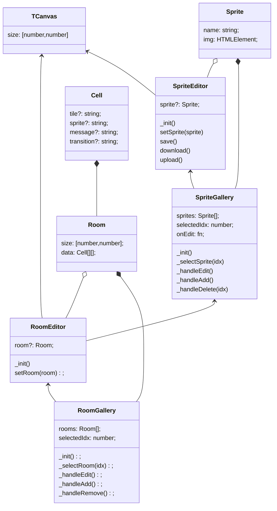

# General Outline

Simple 2d game maker:
- create rooms (stores player sprite, tiles, objects, actions for cells)
- place tiles (background: floor tiles)
- place sprites  (characters: plants, objects, entities)
- add actions for cells (to run when player moves to the tile with objects)
- actions: message, transition (to room)
- sprites and tiles play animation each frame (16x16 px each sprite)
- can draw or load own sprites

## Parts

1. Room select
2. Tiles select
3. Sprties select
4. Image editor (canvas with drawing and resizing)
5. 

